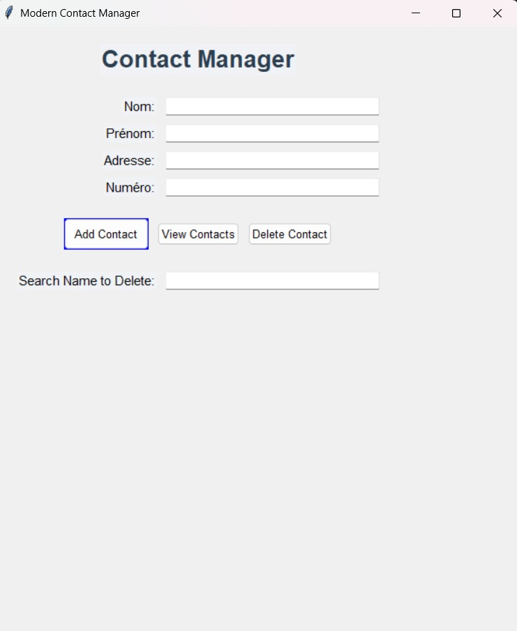
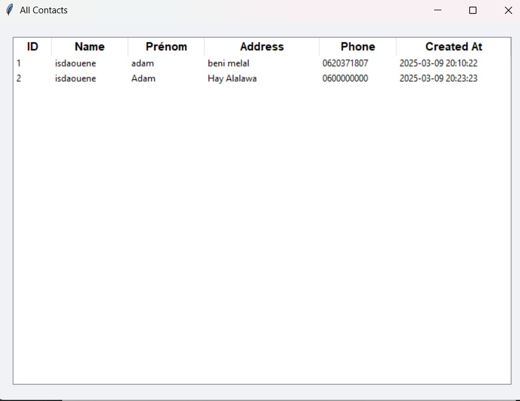

# Modern Contact Manager


## Overview

Modern Contact Manager is a sleek, user-friendly desktop application built with Python, Tkinter, and SQLite. It provides an efficient way to manage personal contacts with a modern graphical interface. Store, view, and delete contact information including names, addresses, and phone numbers, all backed by a persistent SQLite database.

## Features

- **Modern UI**: Clean, flat design with a responsive layout and vibrant orange "Add Contact" button for easy visibility.
- **Contact Management**: Add, view, and delete contacts with validation for required fields (Name and Prénom).
- **Persistent Storage**: Uses SQLite to store contact data, including automatic timestamps for each entry.
- **Tabular Display**: View all contacts in a well-organized table with columns for ID, Name, Prénom, Address, Phone, and Creation Date.
- **Error Handling**: Robust error messages and input validation for a smooth user experience.

## Screenshots

Here are some views of the Modern Contact Manager:

(./asset/image2.jpg)
*The main interface showing input fields and action buttons.*


*The contacts view displaying stored contacts in a table.*
## Requirements

- Python 3.x
- Tkinter (usually included with Python)
- SQLite3 (included with Python)

## Installation

1. Clone the repository:
   ```bash
   git clone https://github.com/yourusername/modern-contact-manager.git
   ```
2. Navigate to the project directory:
   ```bash
   cd modern-contact-manager
   ```
3. Run the application:
   ```bash
   python contact_manager.py
   ```

## Usage

1. Launch the app with `python contact_manager.py`.
2. Enter contact details in the input fields and click "Add Contact".
3. Click "View Contacts" to see all stored contacts in a table.
4. To delete a contact, enter the name in the delete field and click "Delete Contact".

## File Structure

- `contact_manager.py`: Main application code
- `contacts.db`: SQLite database file (created automatically on first run)

## Contributing

Contributions are welcome! Please feel free to submit a Pull Request or open an Issue for bugs, feature requests, or improvements.


This description provides:
- A clear overview of what the app does
- Key features that highlight its functionality and design
- Installation and usage instructions
- Badges for quick tech stack identification
- Placeholders for screenshots (you'll need to add these yourself)
- Standard GitHub README sections for contributions and licensing

You can customize it further by:
- Adding your GitHub username to the clone URL
- Including actual screenshots
- Adding a specific license file
- Modifying the styling to match your preferences
